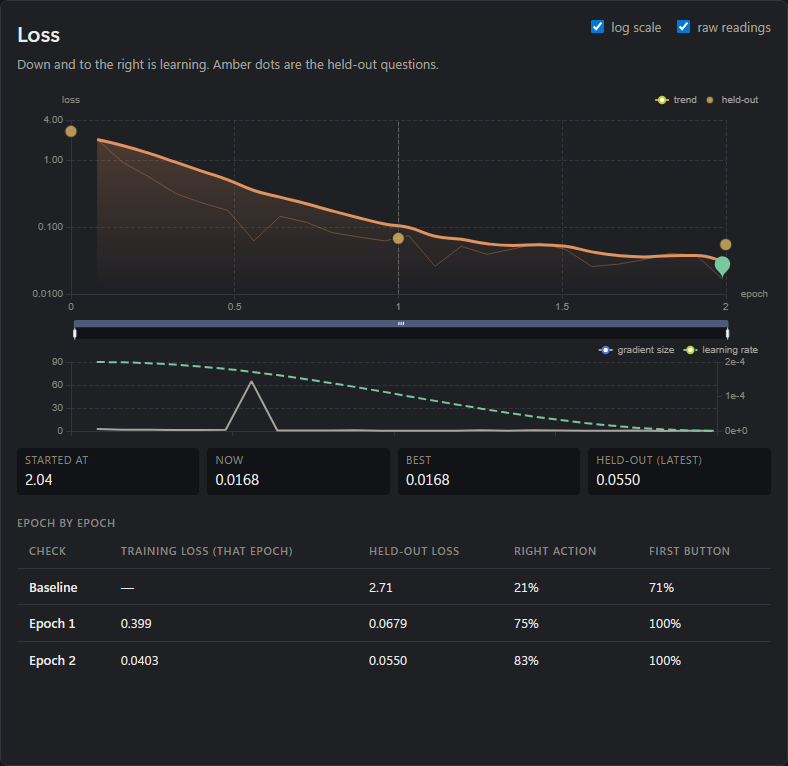

# ReTrain

ReTrain is a Windows-first local training workbench for people who want to fine-tune models on the hardware they actually own.

It turns a complicated run into a sequence that a person can inspect:

~~~
choose a model
  -> inspect data
  -> check readiness and VRAM
  -> preview the run
  -> train
  -> keep receipts, logs, and results together
~~~

## Why it exists

Training tools often assume a clean Linux server, a large budget, and a researcher who already knows which knob matters. ReTrain starts with a real workstation, local model folders, a finite GPU, and a need to know what happened after the button was pressed.

## What works today

- full SFT, LoRA, and QLoRA for supported decoder language-model paths;
- supported Seq2Seq and masked-language-model training;
- model-folder and dataset inspection;
- readiness and estimated-VRAM checks;
- dry-run planning before weights are loaded;
- local logs, receipts, and TensorBoard summaries.
- a Live console with loss charts, per-epoch learning checks, layer signals,
  GPU history, and held-out answer comparisons;
- a script-driven Gemma 4 Unified QLoRA lane with answer-only loss.

Future modes are documented as future modes. This repo does not present a roadmap as a working button.

## Quick start

~~~powershell
.\scripts\install_retrain.ps1
.\scripts\start_retrain.ps1
~~~

Then open http://127.0.0.1:8000.

For the new desktop console, run `launch_retrain_web.bat`. Browser development
and the telemetry format are documented in [the Live console guide](docs/LIVE_CONSOLE.md)
and [the console README](gui/web/README.md). The Live tab only observes runs.
Gemma training currently starts through `scripts/run_gemma4_qlora.py`, rather
than the Configure tab. Alignment/RL choices in the new console remain blocked
because the public runner supports full SFT, LoRA, and QLoRA.

## Live console screenshots

These screenshots show the Live console observing an existing training run.
They include the workstation's local paths and GPU model. See
[the Live console guide](docs/LIVE_CONSOLE.md) for the telemetry format and
the limits of the learning and layer measurements.

### Overview — dark theme

### Overview — light theme

### Loss and training signals

### Learning checks

### Layer signals

### Held-out answers

### Full Live page

### Narrow layout

## Part of a larger practical stack

- [AIWF Studio](https://github.com/nawnie/AIWF-Studio) — local creative AI.
- [Model Operating Kernel](https://github.com/nawnie/Model-Operating-Kernel) — runtime coordination.
- [Atlas Core](https://github.com/nawnie/atlas-core) — provenance, canonical state, approval, and recovery infrastructure.
- [RNV1](https://github.com/nawnie/Rnv1) — long-term local and embodied AI.

ReTrain is public proof of the training side of AI Embedded Systems. The receipts are part of the product: if a run cannot be explained afterward, it was not finished.
