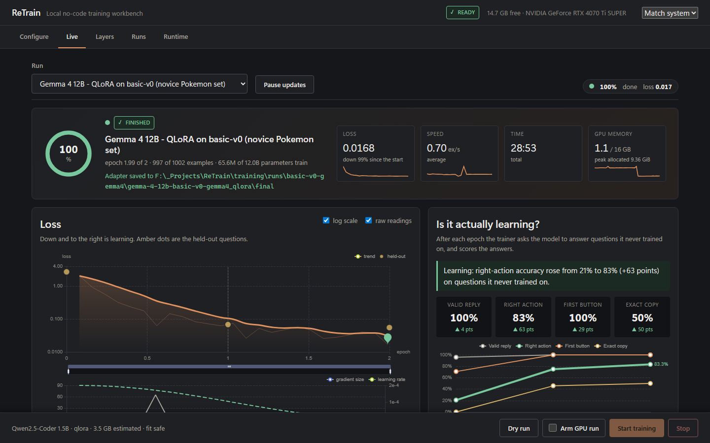
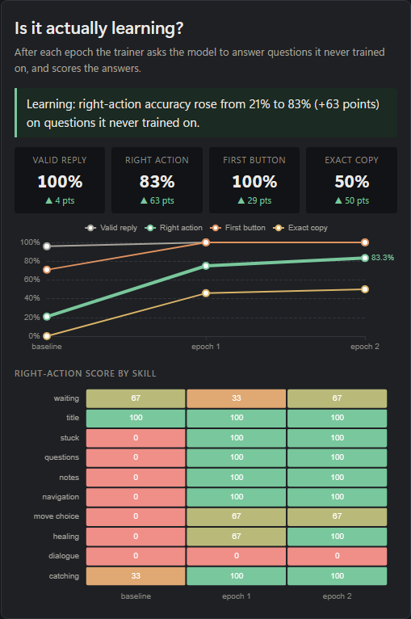
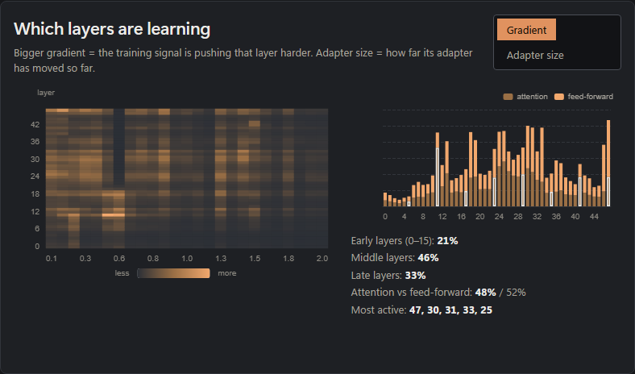
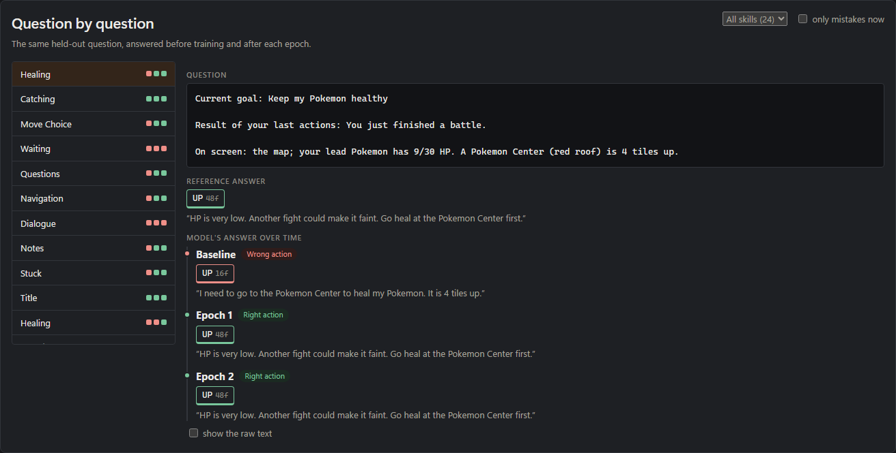
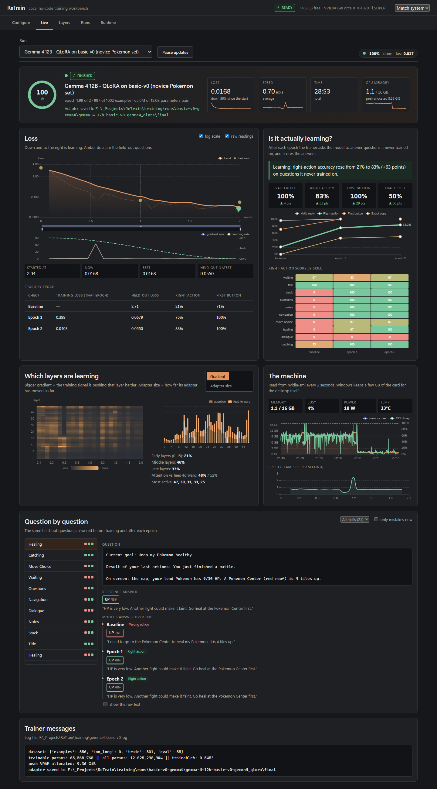
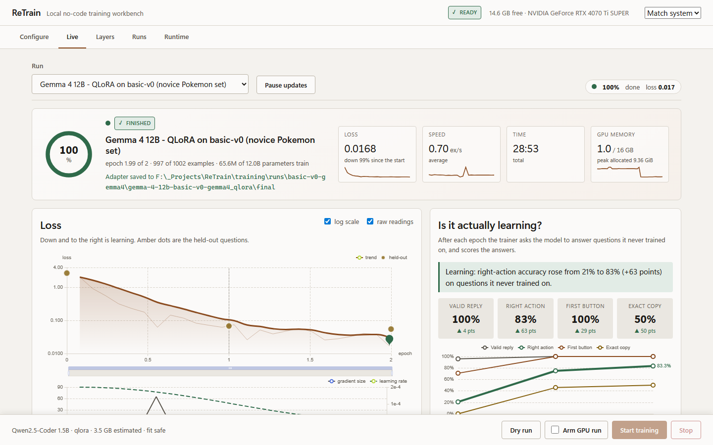
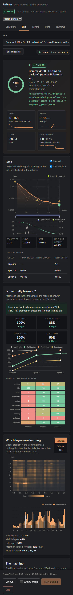

# Watching a training run: the Live console

The **Live** tab of the ReTrain console shows a training run while it happens. It answers the questions a person
actually asks: *Is it running? How long is left? Is the loss falling? Is the model genuinely getting better at the
task, or only fitting its training data? Which layers are doing the learning?*

It only **reads**. Nothing in this tab starts, stops or changes a run, and closing the window never affects training.

## Opening it

Start the console with `launch_retrain_web.bat` (or `npm run dev` in `gui/web`, with the API on
`uvicorn gui.api.app:app`), then choose **Live**. Restart the console after updating: the API gained new
`/api/retrain/live/*` routes.

The desktop console is additive to the existing public dashboard. Its API
bridge and dependency-health helper are included in this checkout. Model
discovery uses the repository's `models/` folder unless `RETRAIN_MODEL_ROOT`
is set. The desktop shell uses the project's `.venv` and does not require Codex.
Gemma training starts with the runner script; starting that lane from Configure
is not wired yet. Alignment/RL selections remain blocked in the console because
the public runner supports full SFT, LoRA, and QLoRA.

## What each card shows

| Card | Answers |
|---|---|
| **Header** | State (loading / training / finished / failed / stopped), progress ring, loss with a trend line, speed, time left, GPU memory. Amber `DEMO DATA` badge on simulated runs. |
| **Loss** | Raw readings, a smoothed trend, best point, epoch boundaries and the held-out loss after each epoch. Log scale, wheel-zoom and a range slider; the gradient size and learning-rate chart underneath zooms with it. An *epoch by epoch* table summarises each check. |
| **Is it actually learning?** | A one-sentence verdict, four scores (valid reply, right action, first button, exact copy) with the change since the untrained baseline, their trend, and a per-skill heatmap of the right-action score. |
| **Which layers are learning** | A layer × time heatmap of gradient size (or adapter size), the running total per layer split into attention and feed-forward, and early/middle/late shares. |
| **The machine** | GPU memory, load, power and temperature history (sampled every 2 s by the API) and training speed over the run. |
| **Question by question** | One held-out question at a time, with the reference answer and the model's answer at the baseline and after each epoch, so a wrong answer turning right is visible. Filter by skill, or show only current mistakes. |

<table>
<tr>
<td></td>
<td></td>
</tr>
</table>

The full page (dark), the light theme, and the layout at the width of a narrow side pane:

<table>
<tr>
<td></td>
<td></td>
</tr>
</table>

The screenshots above are of a real run: Gemma 4 12B fine-tuned (QLoRA, 2 epochs) on a small synthetic
"novice Pokémon player" chat set, scored on 24 held-out questions.

| Check | Valid reply | Right action | First button | Held-out loss |
|---|---|---|---|---|
| baseline (untrained) | 96% | 21% | 71% | 2.71 |
| after epoch 1 | 100% | 75% | 100% | 0.068 |
| after epoch 2 | 100% | 83% | 100% | 0.055 |

Twenty-four questions is a small sample: read these as evidence that the check works and the model learned the
task, not as a benchmark.

## How a trainer feeds the console

Any trainer can appear here by doing three things (see `scripts/run_gemma4_qlora.py` for a complete example).

1. **Register the run** so the console can find it:
   `backend.run_telemetry.register_run(run_id, title=..., log=<log file>, epochs=..., pid=..., layers=<layers.jsonl>)`
   writes `training/live_runs/<id>.json`.
2. **Print these lines to the log** (line-buffered; `--log-file` in the Gemma runner does this):
   * the stock `Trainer` report `{'loss': '0.21', 'grad_norm': '1.4', 'learning_rate': '0.0002', 'epoch': '0.4'}`
   * `dataset: {... 'train': 501 ...}` (used for speed)
   * `VALIDATION {json}` after every learning check: `tag`, `epoch`, `step`, `eval_loss`, `eval_perplexity`,
     the scores `valid_json`, `actions_match`, `first_button_match`, `exact` as **percentages (0-100)**, `n`,
     `seconds`, and `by_category: {name: {n, actions_match}}`
   * finally `peak VRAM allocated: X GiB` and `adapter saved to <path>`
3. **Optionally write files next to the log:** `layers.jsonl` (one line per reading:
   `{"step", "epoch", "layers": [{"i", "attn", "mlp", "upd"}]}`) for the layer view, and
   `validation/<check>.jsonl` (`category`, `prompt`, `expected`, `got`, score flags) for the answers view.

### API

| Route | Returns |
|---|---|
| `GET /api/retrain/live/runs` | every registered run, newest first |
| `GET /api/retrain/live/run?id=` | progress, loss series with times, checks, speed, time left, messages |
| `GET /api/retrain/live/layers?id=` | per-layer totals and the step × layer matrices |
| `GET /api/retrain/live/samples?id=` | held-out questions with the answer at each check |
| `GET /api/retrain/live/system` | recent GPU history |

## Trying it without a GPU

`python scripts/make_live_demo.py` writes a **simulated**, clearly labelled finished run (`demo: true`; the console
shows a `DEMO DATA` badge). Its numbers are generated from a fixed seed and are not a result.

## Terminal view

`python scripts/training_monitor.py --log <log> --epochs 2` draws the same numbers in a terminal, using the same
parser (`backend/run_telemetry.py`).

## Verification

* `pytest tests` - the telemetry parser, the Gemma runner's scoring/masking, and a check that every runner builds
  `TrainingArguments` with the installed transformers.
* `npm run build` in `gui/web` (TypeScript + Vite).
* The page was inspected with Playwright at 1440×900, 900 and 420 px wide, dark and light, against both the demo run
  and a live training run.

## Known limits

* The layer view shows gradient and adapter size per layer, not a causal "importance" score.
* The 3D *Layers* tab is not yet coloured by live training signal.
* Starting a run from the *Configure* tab through this runner is not wired yet; start it with
  `python scripts/run_gemma4_qlora.py --help`.
* Answers and scores come from a fixed sample of held-out questions, so early checks are noisy.
